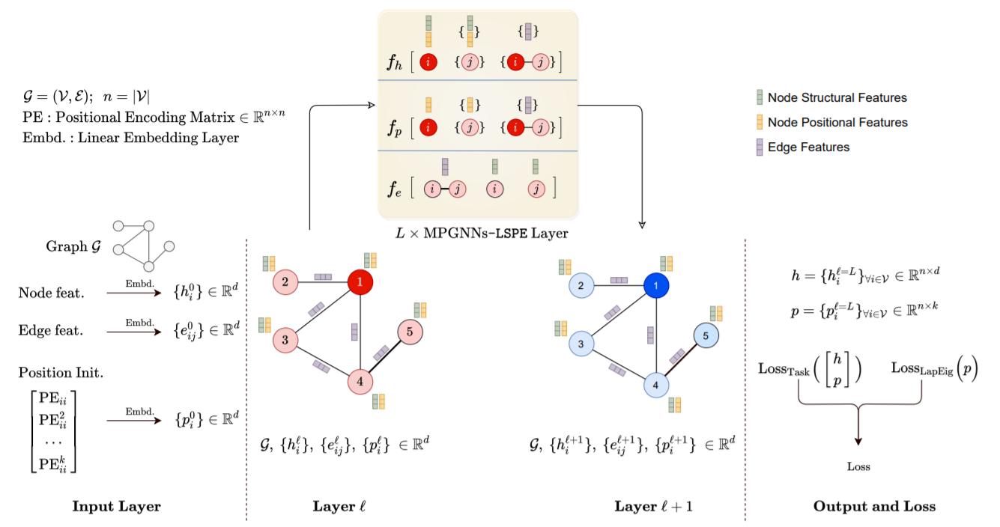

# Graph Neural Networks with <br/> Learnable Structural and Positional Representations

<br>

Source code for the paper "**[Graph Neural Networks with Learnable Structural and Positional Representations](https://arxiv.org/abs/2110.07875)**" by Vijay Prakash Dwivedi, Anh Tuan Luu, Thomas Laurent, Yoshua Bengio and Xavier Bresson.

We propose a novel GNN architecture in which the structural and positional representations are decoupled, and are learnt separately to learn these two essential properties. The architecture, named **MPGNNs-LSPE** (MPGNNs with **L**earnable **S**tructural and **P**ositional **E**ncodings), is generic that it can be applied to any GNN model of interest which fits into the popular 'message-passing framework', including Transformers.

  

<br>


## 1. Repo installation

[Follow these instructions](./docs/01_repo_installation.md) to install the repo and setup the environment.


<br>

## 2. Download datasets

[Proceed as follows](./docs/02_download_datasets.md) to download the benchmark datasets.


<br>

## 3. Reproducibility 

[Use this page](./docs/03_run_codes.md) to run the codes and reproduce the published results.


<br>

## 4. Reference 

:page_with_curl: Paper [on arXiv](https://arxiv.org/abs/2110.07875)
```
@article{dwivedi2021graph,
  title={Graph Neural Networks with Learnable Structural and Positional Representations},
  author={Dwivedi, Vijay Prakash and Luu, Anh Tuan and Laurent, Thomas and Bengio, Yoshua and Bresson, Xavier},
  journal={arXiv preprint arXiv:2110.07875},
  year={2021}
}
```


<br><br><br>

